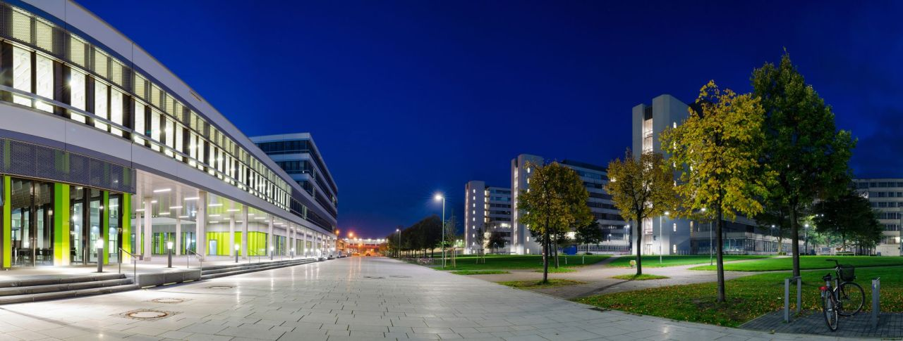

# Venue & Location

**Bielefeld exists and welcomes you!**

We are in the heart of Eastern Westphalia, just around the corner from Hannover, Dortmund, Cologne and the Netherlands. While enjoying life in the green, we feel very Euro-central and well connected to a number of international airports (DTM - 80 min away by train, HAJ - 90 min, DUS, PAD - 2 h, CGN, HAM, TXL - 3h by train, SXF, FRA - 3.5 h, AMS ~ 4 h).

Bielefeld has for a long time been an industrial hub. Since the 17th century is has developed as a centre of linen production and trade. In the 20th century it became additionally an important centre of machine and food industries and of psychiatric healthcare. During World War II major parts of the city, -- including the old town -- have been destroyed. 
The landmark of the city is the Sparrenberg Castle, a restored fortress from the 13th century with a catacomb network, which offers a nice panoramic view over the city.

## Accomodation

Accommodation is **not** part of the conference service.
As you will be attending to an event organised by the University of Bielefeld, you will be eligible for a discounted stay at several hotels such as the [Garni Hotel](www.comfort-garni.de).
Otheriwse, you will most certainly be able to find an affordable and pleasant solution on popular platforms such as Airbnb or booking.com.

## Transport

The campus is at the west side of the city, easily reachable by tram and bus, or with a 30 minutes walk from the central station.
You might also consider the bike sharing service [meinSiggie](https://www.mobiel.de/sharing/meinsiggi-fahrrad/) (unfortunately their webpage is in German only)

